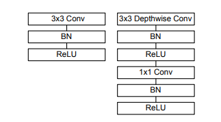
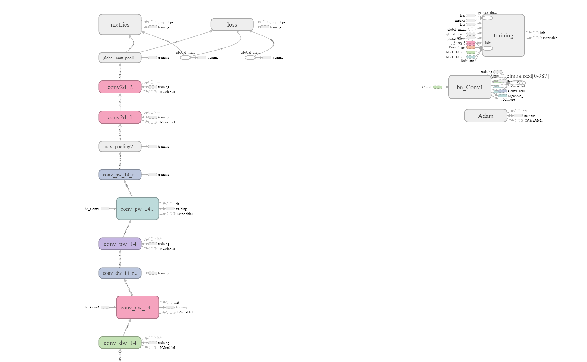
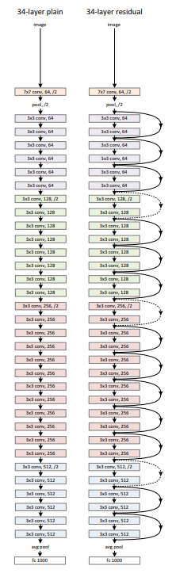

# Flipkart Object Localization

Flipkart Object Localization Challenge consists of developing a model that localizes (identifies the bounding box) the object in an image. Simply put, given an image, the model should produce coordinates of the rectangle where in the object lies.

## Getting Started

Python is the programming language used for this Challange. openCV, Numpy, Pandas, Tensorflow, Keras are extensively used for training.

### Installing

To install all packages run this command

```
pip install -r requirmenets.txt
```
### Weights Link 

Weights can be downloaded here.
https://drive.google.com/open?id=1041WzZt5Duimm_YnVdDeJf-EozCV-Rvt

### Approach

The Images are fed into a deep neural network and features are extracted using Architectures like Resnet50 and Mobilenet.
Deep networks naturally integrate low/mid/highlevel features and classifiers in an end-to-end multilayer fashion, and the “levels” of features can be enriched by the number of stacked layers (depth).
The Features extracted using those architevctures are fed into further layers to generate desiderd output.



Left: Standard convolutional layer with batchnorm and ReLU. Right: Depthwise Separable convolutions with Depthwise and Pointwise layers followed by batchnorm and ReLU for Mobilenet


Figure shows final layers after Mobilenet.




Example network architectures for Classification.
Left: a plain network with 34 parameter layers.Right: a residual network with 34 parameter layers.


IOU is used as a metric.


Final Mobilenet Archticeture


Final Resnet Archticeture


### Training

To train the Neural Network there are two options

* For Resnet50
```
python3 train.py
```
* For MobileNet
```
python3 trainMobileNet.py
```
### Testing

To test the Neural Network and get predictions

```
python3 test.py
```

## for Google Colab
If using Google Colab run notebooks in following order
```
Initial.ipynb
Train.ipynb
Test.ipynb
```


## Authors

* **Akashdeep Jassal** 
* **Krishna Bhardwaj** 
* **Rhydham Gupta** 

## Acknowledgments

* Flipkart Team
* Dare2Compete team
* Team at Google Resarch for platforms like Google Colab, Tensorflow, Tensorboard, Keras
* Prof. Andrew NG for deeeplearning.ai specialization
* Github team of keras
* Stack Overflow
